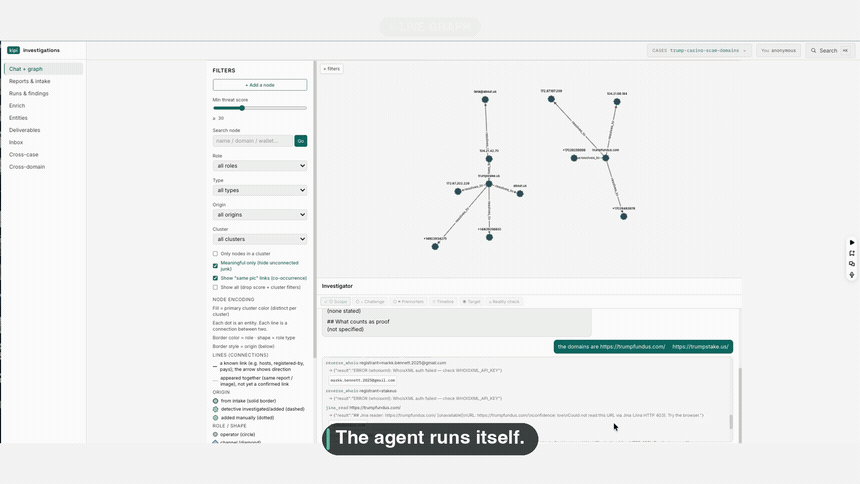

# kipi

**Drop a dense intel report on it. Get a live, investigated entity graph.**



The graph above built itself. One seed domain went in. An agent pulled WHOIS, DNS, certificates, and the live sites, then pivoted on what it found. No queries to write. [Watch the full 75 seconds, with sound.](docs/demo.mp4)

kipi is an open-source, self-hosted OSINT investigation platform. It turns documents into an investigation. PDFs, screenshots, spreadsheets, pasted notes go in. A typed entity graph comes out. Then an autonomous investigator digs the open web and builds the graph out in front of you: infrastructure pivots, typed edges, gated findings, a written brief.

The analyst stays the top authority. Every schema, finding, and edge gets confirmed, corrected, or rejected by a human. The machine proposes. You decide.

Two things sit together here that I never found in one commercial OSINT platform: document ingestion into entities, and real graph analytics (centrality, communities, pathfinding) on the same investigation canvas.

## What you're watching

The demo runs a real case. Two seed domains go in: `trumpfundus.com` and `trumpstake.us`.

By the end, kipi has mapped a Russian-language affiliate fraud network. White-label fake crypto casinos. The backend operator is registered to a shell company in Reykjavík, one month after Brian Krebs killed its predecessor. 20,000+ affiliates. 60 to 80 percent of stolen deposits, paid out in crypto. A Musk-branded clone, flagged for phishing, sitting in the same cluster.

Then it writes the brief. Every claim carries its source and an evidence grade. A DNS record grades an A. An analyst's read is a lead, nothing more. Nothing gets promoted on a name match.

That grading is the point. Most OSINT output reads like a pile of links. This reads like a case.

## Quickstart (10 minutes)

```bash
git clone https://github.com/assafkip/kipi.git && cd kipi
./install.sh                           # venv + deps + DB; checks tesseract/claude
export ANTHROPIC_API_KEY=sk-ant-...    # the ONE required key
./invctl serve                         # open http://127.0.0.1:8765
```

Then:

1. **Reports** → drop a PDF (or paste notes). Entities extract on upload.
2. **Schema gate** → approve the proposed per-case ontology (one click; the agent fits the entity types and roles to your case's domain).
3. **Process** → consolidation, typing, correlation, scoring, graph analytics, the brief. Watch the step bar.
4. **Graph** → tell the investigator chat to dig (`investigate suspicious-domain.com`) and watch nodes land live.

## Keys

One key is required. Everything else degrades gracefully.

| Key | Required? | Without it |
|---|---|---|
| `ANTHROPIC_API_KEY` | **Yes** | No entity classification, no schema proposal, no brief |
| `claude` CLI (+ node 18+) | Optional | The autonomous investigator agent is disabled; ingest, Process, and the graph still work |
| `tesseract` binary | Optional | Scanned-PDF / screenshot OCR skipped |
| `VIRUSTOTAL_API_KEY` | Optional | VT reputation pivots report needs-key and skip |
| Apify / Perplexity / Tavily / Exa / WhoisXML / Censys / abuse.ch / HudsonRock / Etherscan | Optional | Each reports needs-key and skips cleanly |
| Keyless belt | - | whois, DNS, RDAP, reverse-DNS, crt.sh, Shodan InternetDB, Gravatar, IP-geo, username sweep, email triage (MX/SPF/DMARC + header→IP), BTC wallet. All work with zero keys. |

## The analyst's graph

- **Layouts** - force (default), hierarchy (dagre), ego rings around the selected node, circle.
- **Pathfinding** - pick two nodes; the shortest path lights up, everything else dims. "How is this wallet connected to that channel" in two clicks.
- **Graph analytics** - betweenness centrality finds the broker between two cells; Louvain communities split a sockpuppet net into operating cells. Computed per case, stored as node properties, drive styling.
- **Conditional formatting** - persisted per-case style rules with an editor: betweenness→size, analyst-vs-AI origin→border, community→color (opt-in).
- **Collection nodes** - 200 crt.sh subdomains fold into one expandable "200 domains" bucket instead of flooding the canvas.
- **Time-bounded edges** - re-observing a relationship updates its first-seen/last-seen instead of duplicating it.
- **Provenance everywhere** - every node and edge knows how it entered the graph (ingest, enrichment provider, agent, analyst).

## Who it's for

kipi is built for people who investigate for a living:

- Boutique threat-intelligence firms running client cases.
- Trust and safety teams mapping abuse networks on a budget.
- Private investigators and OSINT freelancers who need a graph, not a spreadsheet.
- Fraud and AML analysts tracing crypto wallets and infrastructure.
- Journalists working a document leak.

If your job is turning messy documents into "who is connected to whom, and how do we know," kipi is for you.

## How kipi compares

Most OSINT tools pick one job. kipi does two that rarely live together: reading documents into entities, and running real graph analytics on the same canvas.

- Link-analysis tools like Maltego draw the graph, but you feed them entities by hand. They don't read your documents.
- OSINT frameworks like SpiderFoot scan infrastructure, but hand you a list, not an investigated graph with provenance.
- Commercial intel platforms do all of this behind a five-figure seat and a model you can't inspect.

kipi reads the document, proposes the ontology, digs the web, grades the evidence, and writes the brief. Self-hosted. One required API key. Source-available.

## Runs locally

Everything runs on your machine: SQLite database, local vault, local assets. The only required external call is the Anthropic API for classification and judgment. OSINT lookups go to the providers you enable, nowhere else. Run `bash scripts/oss_secrets_audit.sh` before sharing anything.

## License

[Elastic License 2.0](LICENSE), source-available. Use kipi freely, including in your paid investigation work. Modify it. Self-host it for your own use. You may not sell kipi itself, or offer it to others as a hosted or managed service. Commercial licensing of the software stays with KTLYST Labs.

In plain terms: run it, fork it, use it on client work. Don't repackage it and sell it.

## FAQ

### Is kipi free?
Yes. Source-available under the Elastic License 2.0. Use it, fork it, run it on paid client work. You just can't resell kipi itself or offer it as a hosted service.

### Is kipi a Maltego or SpiderFoot alternative?
For a lot of workflows, yes. kipi reads your documents into entities and runs graph analytics (centrality, communities, pathfinding) on the same canvas. Most link-analysis and OSINT-scanning tools do one side, not both.

### Do I need API keys?
One: `ANTHROPIC_API_KEY`, for classification and the brief. Every OSINT provider is optional. The keyless belt (whois, DNS, RDAP, crt.sh, Shodan InternetDB, Gravatar, IP-geo, username sweep, email triage, BTC wallet) works with zero keys.

### Is it self-hosted? Does my data leave my machine?
Self-hosted. SQLite, vault, and assets all live locally. The only required external call is the Anthropic API for classification and judgment. OSINT lookups hit only the providers you turn on.

### What can kipi ingest?
PDFs, Word docs, images, screenshots, spreadsheets (CSV and XLSX), and pasted notes. Scanned PDFs and screenshots get OCR in six languages.

### What does the autonomous agent actually do?
You give it a seed: a domain, a wallet, a handle. It pulls WHOIS, DNS, certificates, and live pages, pivots on what it finds, and lands typed nodes on the graph. Every finding carries a source and an evidence grade.

### Can I use kipi for paid client work?
Yes. The Elastic License 2.0 allows commercial use, including paid investigations. The only thing it blocks is selling kipi itself, or running it as a service for others.

### What is kipi built on?
Python, SQLite, and the Anthropic API for the language-model work. The autonomous investigator runs on the Claude CLI. No heavyweight database or cloud account required.

## Who built this

I spent 12 years running threat intelligence and investigations at LinkedIn, Google, Meta, and ElevenLabs. kipi is the tool I wanted on every one of those desks, and never had.

The repo is free. If you have a network that needs mapping, or you want a case run for you, reach me through KTLYST Labs. The code is open. The tradecraft is the offer.
